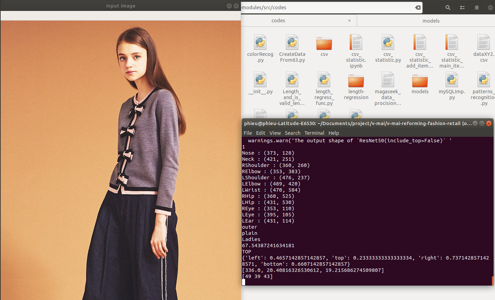

# v-mai-reforming-fashion-retail

## 1. Open-pose setup
follow [this](vendors/tf-pose-estimation/README.md) to install open-tfpose
## 2. V-mai project
### Requirements
```
scikit-learn
tensorflow
keras
csv
request
shutil
pickle
lightgbm
xgboost
```
### Run test.py to check if the install succeed
```shell
cd ai-modules/src/codes
python test.py
```
if the install succeed, it should be show a result like this

